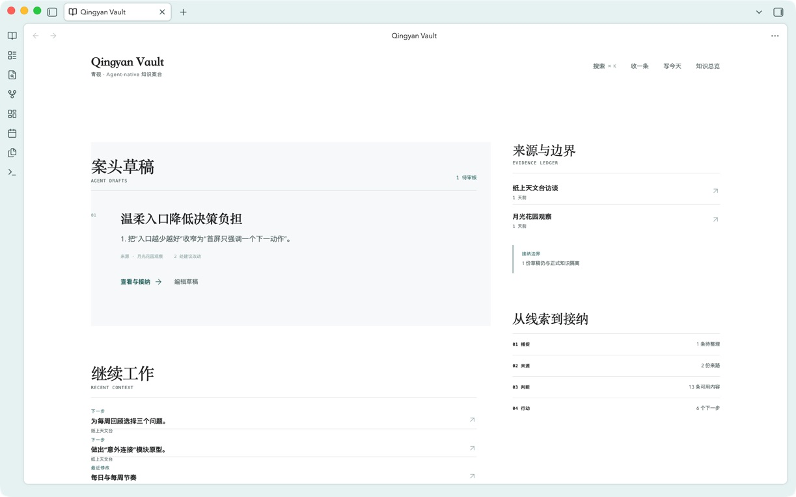
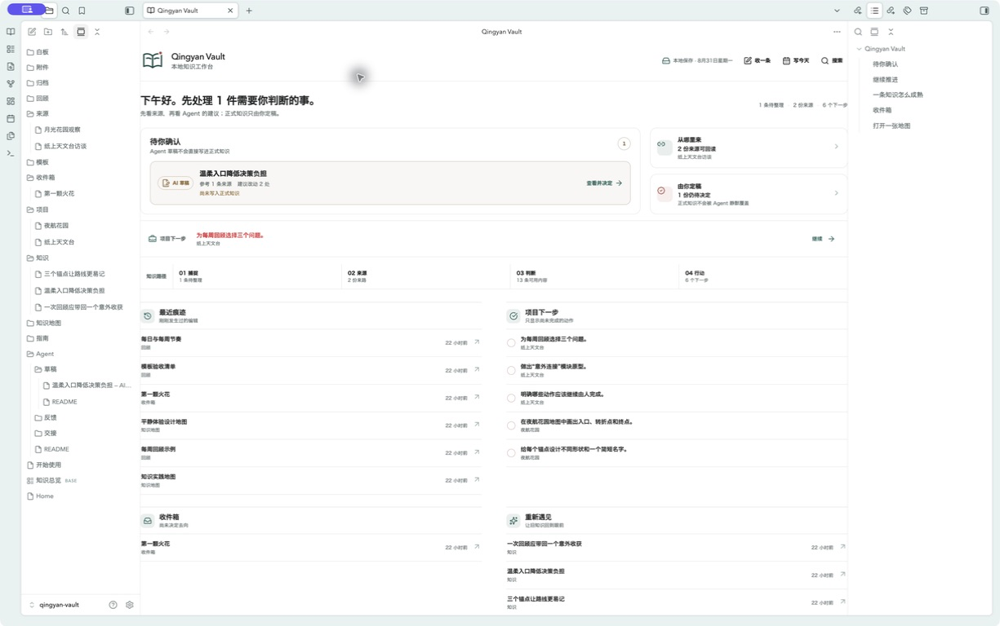
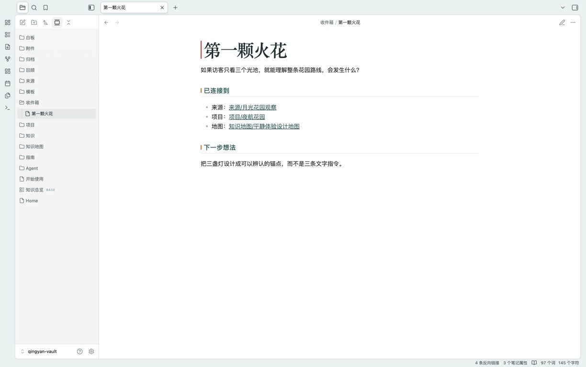
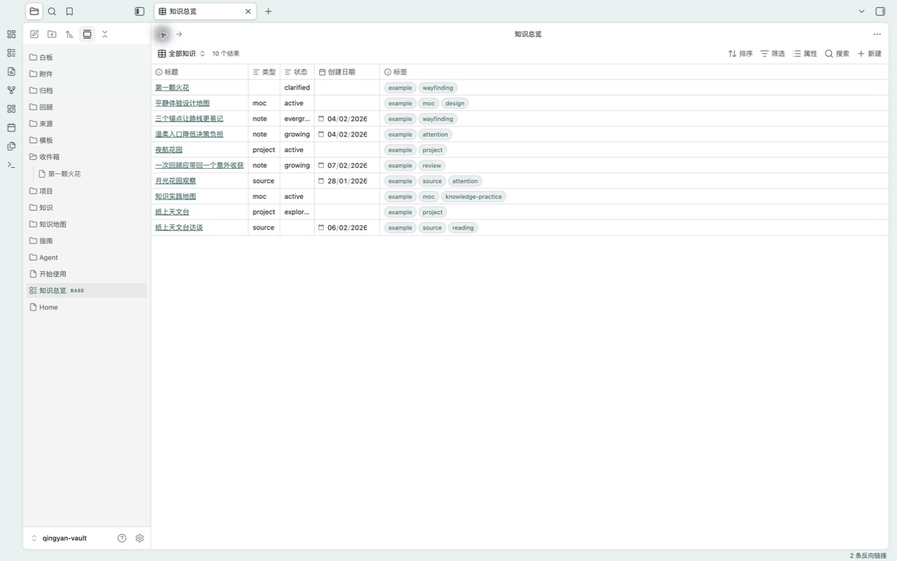
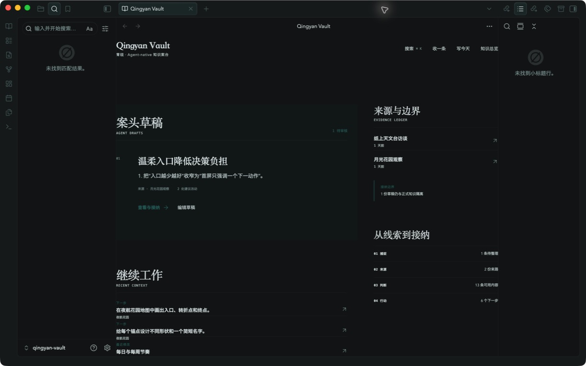

<div align="center">
  
  <p><strong>A ready-to-use, Chinese-first Obsidian vault where agents draft and people decide.</strong></p>
  <p><a href="README.md">简体中文</a> · English</p>
</div>



## Working in one minute

1. Download and unzip the latest `qingyan-vault-*.zip` from [Releases](https://github.com/chicogong/qingyan-vault/releases).
2. Open the extracted folder as an Obsidian vault.
3. Trust and enable the bundled first-party homepage, or stay in safe mode and use `Home.md`.
4. Choose **Capture**, write one sentence, and find it again from `收件箱/` on Home.

No account, network connection, model, or plugin setup is required.

## The missing first layer

Many templates stop at folders and appearance. Many AI knowledge tools begin with chat, indexing, skills, or heavy automation. Qingyan Vault starts with a complete daily loop and keeps advanced controls optional.

```text
capture → preserve sources → form a judgment → isolated agent draft → human acceptance → reuse
```

| What matters | Qingyan Vault's answer |
| --- | --- |
| First-open clarity | A Chinese Home, semantic folder shelf, synthetic examples, and a 60-second loop |
| Safe agent changes | Read-only by default; isolated drafts; facts, inference, and unknowns stay separate |
| Portability | Markdown, WikiLinks, YAML, Bases, and Canvas remain the source of truth |
| Graceful fallback | Disable the homepage and keep static Home, search, Bases, Canvas, and every note |
| Data boundary | Local files by default; no account, network call, telemetry, or bundled model |
| Stricter governance | Optional LLM Wiki Canvas review for source binding, precise diffs, and conflict blocking |

The shipped folder names are Chinese by design: `收件箱/` (inbox), `来源/` (sources), `知识/` (knowledge), `项目/` (projects), `知识地图/` (maps), and `回顾/` (review). `Agent/` remains the cross-tool protocol folder.

The point is not “AI writes more.” It is that your knowledge remains readable after you change models, tools, or machines—and every proposed change remains explainable, rejectable, and reversible.

## Real product surfaces

<table>
  <tr>
    <td width="50%"><br><sub>Cover workbench with resume, capture, and resurface actions</sub></td>
    <td width="50%"><br><sub>Capture directly into the visible work surface</sub></td>
  </tr>
  <tr>
    <td width="50%"><br><sub>Core Bases, no Dataview dependency</sub></td>
    <td width="50%"><br><sub>The same evidence, draft, and human-decision structure remains readable in dark mode</sub></td>
  </tr>
</table>

## Agent-native, not agent-controlled

Codex reads `AGENTS.md` at the root. Claude Code follows the thin `CLAUDE.md` adapter. WorkBuddy, Qoder, and other file-based agents can be pointed at the same policy. Permissions progress from read-only, to isolated drafts, to named-file edits, to explicitly approved structural changes. Agents do not silently rewrite accepted knowledge, move files, install plugins, connect accounts, or publish.

## Minimal plugin surface

The archive enables one audited first-party plugin, `Qingyan Vault Homepage`. It reads local Markdown and metadata, writes only when Capture is clicked, and has no network API, model call, or telemetry. Border provides the mature app shell; Qingyan CSS provides the Home, folder shelf, and reading system. Disable either layer without losing content.

## Verify

```sh
./.starter-tools/self-check.sh
./.starter-tools/build-release.py --check
```

The repository uses synthetic examples only. Current evidence covers a clean release archive and local Obsidian testing; Windows, Linux, mobile, and real long-term adoption remain to be verified.

See the [Chinese README](README.md), [product thesis](维护/产品.md), [roadmap](规划.md), [security policy](SECURITY.md), and [contribution guide](CONTRIBUTING.md).

## License

MIT. The bundled Border theme retains its original MIT license and attribution. Obsidian is governed by its own license.
